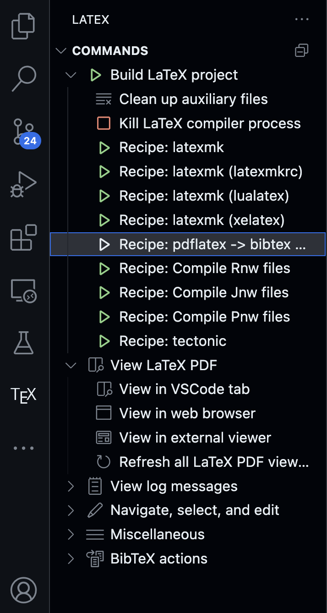

# LaTeX in VS Code

## Chuẩn bị

1. **LaTeX Workshop**  

    LaTeX Workshop là một extension mạnh mẽ cho VS Code, giúp dễ dàng biên dịch và xem tài liệu LaTeX trực tiếp trong trình soạn thảo. Tải extension này từ Visual Studio Marketplace theo đường link bên dưới:
    [https://marketplace.visualstudio.com/items?itemName=James-Yu.latex-workshop](https://marketplace.visualstudio.com/items?itemName=James-Yu.latex-workshop)

2. **MiKTeX (Modern TEX distribution)**  

    MiKTeX là một hệ thống phân phối TeX, cung cấp tất cả các công cụ cần thiết để biên dịch tài liệu LaTeX. Có thể tải MiKTeX từ trang web chính thức theo liên kết dưới đây:

    [https://miktex.org/download](https://miktex.org/download)

---

## Cách để build một source code LaTeX

1. **Mở Command Palette** trong VS Code:  
    - **Menu**: *View → Command Palette*  
    - **Phím tắt**: <kbd>Ctrl</kbd> + <kbd>Shift</kbd> + <kbd>P</kbd>

2. **Chọn một Build Recipe**  
    - Gõ `Latex workshop: build with recipe`.  
    - Chọn `pdflatex -> bibtex -> pdflatex -> pdflatex` thay vì `latexmk`.

3. **Xây dựng trực tiếp**  
    - Sử dụng phím tắt <kbd>Command</kbd> + <kbd>Option</kbd> + <kbd>B</kbd> để build.
    - Với Windows, sử dụng phím tắt <kbd>Ctrl</kbd> + <kbd>Alt</kbd> + <kbd>B</kbd>.

4. **Xem PDF**  

Sau khi build thì 1 pdf đã được tạo, bạn có thể mở file xem trực tiếp hoặc có thể xem qua các hình thức:    



Mở Extension Latex Workshop, trong hộp `Commands/View LaTeX PDF`:
- View in VSCode tab
- View in web browser

1. Các lỗi có thể mắc phải

Do source code LaTeX trong project này có sử dụng package hỗ trợ tiếng việt `vntex`. Nhưng buồn thay package này lại không có sẵn trong MiKTeX, nên bắt buộc phải tải thêm thông qua cú pháp:

```bash
tlmgr install package
```

> Note: Lưu ý đảm bảo khi tải package terminal phải được run as administrator. Tham khảo [Permission problem when installing package from tlmgr](https://tex.stackexchange.com/questions/187073/permission-problem-when-installing-package-from-tlmgr) để có thể khắc phục.
